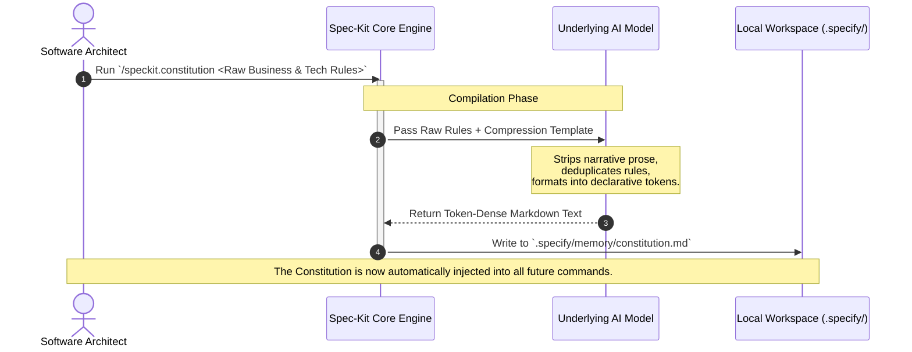

# Part 2. Drafting an Immutable Constitution - Optimizing Global Prompts

In the [first article]() of this series, we mapped out the 7-step lifecycle of Spec-Kit and introduced the concept of **Context Isolation**. We established that the local files in your repository serve as an immutable state machine, allowing us to sever conversational chat history and keep LLM payloads lean.

But context isolation only works if the model still understands your organizational boundaries, architectural stacks, and security compliance rules. If we don’t pass this information in a chat history, where does it live?

It lives in the **Constitution** (`.specify/memory/constitution.md`).

The constitution is the universal ballast of your Spec-Kit environment. It is programmatically injected as a foundational system prompt into almost every single slash-command execution. Because it is omnipresent, an unoptimized constitution is the single greatest contributor to token bloat and model fatigue.

Let’s look under the hood at how the engine processes the constitution, how to optimize its structural token footprint, and how to write rules that enforce strict compliance without wasting computing resources.

## The Mechanical Lifecycle of `/speckit.constitution`

The constitution isn’t just a static markdown document you write by hand and leave alone. It is an agentically managed artifact initialized and optimized via the `/speckit.constitution` command.



When you execute `/speckit.constitution`, the engine takes your messy internal wikis, compliance bullet points, and tech stack choices, and passes them to the LLM alongside a strict compression meta-template. The model's job during this initialization phase is to act as a compiler: it strips out linguistic fluff, groups overlapping rules, and outputs a highly dense, declarative markdown schema designed for optimal token weight and semantic clarity.

## Anatomy of a High-Efficiency Constitution

To prevent your constitution from eating up your entire context window, the document must be strictly compartmentalized. A high-efficiency constitution should be capped at **500 to 800 tokens** and strictly adhere to a flat, three-sector layout:

### 1. The Global Guardrails (Negative Constraints)

LLMs respond with much higher fidelity to negative constraints ("Never do X") than to passive suggestions ("Try to avoid X"). This section must be reserved for non-negotiable boundaries like security, privacy, and compliance.

- **Flabby (Wastes Tokens):** _"We need to make sure that we are keeping user data safe. Please do not log passwords or any personally identifiable information to the console because it violates our security policy."_
- **Lean (Saves Tokens):** `* NEVER: Log PII, credentials, or session tokens to application logs.`

### 2. The Architectural Stack (Hard Assertions)

Do not allow the model to guess your infrastructure or propose alternative libraries. If your team uses a specific stack, state it as a hard constraint. This eliminates the need for downstream planning agents to debate architectural patterns.

```markdown
### ARCHITECTURAL STACK
* BACKEND: .NET 8 Web API, C# 12
* ORM: Entity Framework Core (Code-First)
* DATABASE: PostgreSQL
* OBSERVABILITY: OpenTelemetry protocol (OTLP) to Cloud Trace
```

### 3. Context Boundaries (Scope Enforcers)

This section defines the high-level business domain of your system so the model understands the ambient language of your codebase without needing a massive dictionary file.

```markdown
### SYSTEM CONTEXT
* DOMAIN: Enterprise Asset Management (EAM)
* TARGET AUDIENCE: Field engineers operating with intermittent network connectivity.
* CORE STATE: Offline-first synchronization via local SQLite caching.
```

## Token Economics: Calculating the Constitution Tax

Why are we being so aggressive about the word count of a single markdown file? Because of the **Multiplication Tax**.

Consider a typical feature development cycle consisting of 1 specification, 1 clarification loop, 1 planning execution, and 5 separate task implementations (8 distinct LLM interactions total).

Let’s look at the compounding cost math between a bloated constitution and a streamlined one:

|Metric|The Bloated Constitution|The Streamlined Constitution|
|---|---|---|
|**Character/Word Count**|~2,500 words (Narrative style)|~500 words (Declarative style)|
|**Token Cost per Request**|~3,200 tokens|~650 tokens|
|**Total Cost for 8-Step Lifecycle**|**25,600 input tokens**|**5,200 input tokens**|
|**Model Attention Degradation**|High (Lost in the Middle)|Near Zero (High Density)|

By treating your constitution like production source code—refactoring it, compressing its grammar, and removing conversational noise—you save nearly **80% of your foundational input tokens** before your developers even type their first line of functional intent.

## The Golden Rule of Constitutional Governance

The most critical operational rule when managing your Spec-Kit environment is this: **If a constraint applies to less than 80% of your application, remove it from the constitution.**

Local feature variations do not belong in global memory. If a single feature requires specialized encryption or a unique UI framework, that rule belongs inside the explicit user prompt passed to `/speckit.specify` for _that feature alone_. Keep your constitution pure, systemic, and absolute.

## What’s Next

Now that we have established an immutable, token-optimized global playground via our constitution, we can safely allow our developers to begin defining features.

In [**Part 3: The Specify & Clarify Loop**](), we will analyze the mechanical handshake between `/speckit.specify` and `/speckit.clarify`, exploring how to extract rock-solid product requirements from a tiny seed prompt without triggering a massive rewriting tax.
