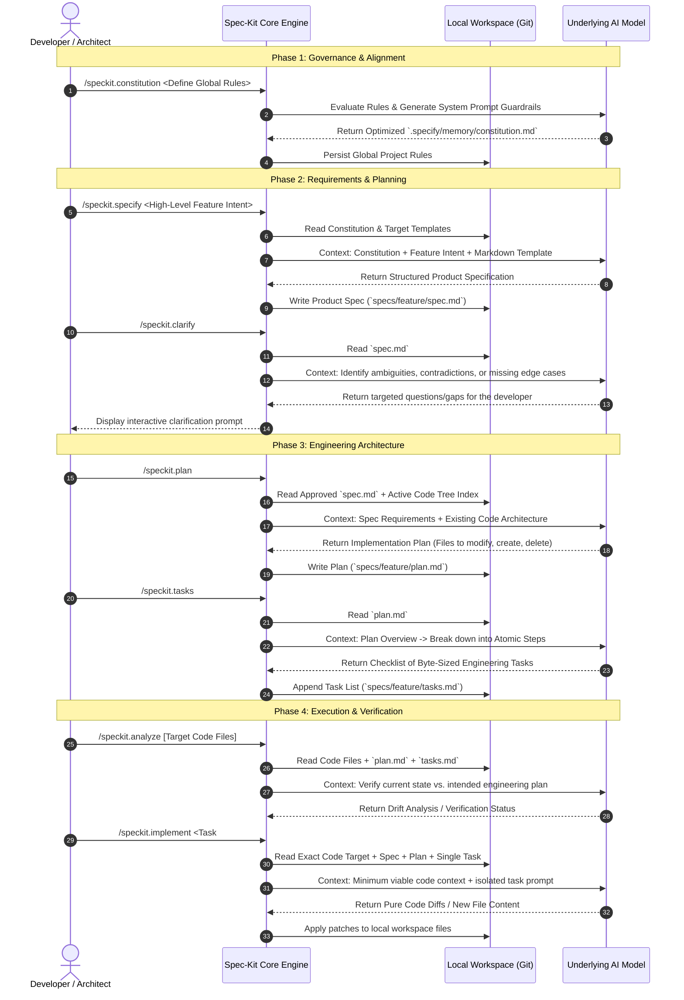

# Part 1. Inside Spec-Kit - How Prompts, Context, and LLMs Coordinate to Write Software

Modern AI coding assistants often treat the Large Language Model (LLM) like a chat box - you throw code and prompts at it, and it throws code back. While this works for small scripts, it falls apart on production-grade codebases where context drift, token bloat, and hallucinations quickly compound.

GitHub’s **Spec-Kit** framework takes a radically different approach known as **Spec-Driven Development (SDD)**. Instead of relying on a single, massive prompt, Spec-Kit breaks the software development lifecycle into **7 distinct agentic boundaries**. Each boundary represents a specialized slash-command that isolates context, optimizes token usage, and interacts with the underlying LLM with a highly specific, surgical intent.

Here is an architectural look at how these 7 core steps choreograph their interactions with the underlying LLM to transform a raw idea into production-ready code.

## The 7-Step Spec-Kit Lifecycle Architecture

The following sequence diagram illustrates the chronological progression of a feature within Spec-Kit. It maps out how the framework continually builds, clarifies, plans, and validates information by making isolated, targeted API requests to the LLM.

## Deconstructing the LLM Interaction Mechanics

To understand why Spec-Kit is so efficient, we have to look at what is happening under the hood during these API payloads. The architecture solves the "Maximum Context Window" problem by strict categorization.

### 1. Context Isolation (The "Anti-Bloat" Strategy)

In a typical AI chat assistant, if you are on step 7 (writing code), your chat history contains the original feature request, the mid-way arguments, the architectural debates, and old code snippets. The LLM has to parse thousands of redundant tokens.

Spec-Kit completely severs this history. Notice in **Step 7 (/speckit.implement)**, the engine does _not_ pass the entire conversation history to the model. Instead, it programmatically constructs a clean payload consisting of:

- The **Global Governance** (`constitution.md`)
- The **Isolated Architectural Task** (`tasks.md` step #3)
- The **Target File** needing modification.

By keeping the context window laser-focused, the model has fewer variables to juggle, resulting in near-zero code hallucination rates.

### 2. State-Driven Handshakes

Each slash-command acts as a state transition. The output of one LLM call becomes the foundational structural input for the next:

- **The Product Handshake:** `/speckit.specify` takes business intent and outputs structural markdown.
- **The Engineering Handshake:** `/speckit.plan` consumes that markdown, matches it against your repository's abstract syntax tree (AST), and outputs structural architecture.
- **The Execution Handshake:** `/speckit.tasks` parses the architecture into discrete execution blocks.

Because the data passed between steps is written to disk as clear markdown files (`spec.md`, `plan.md`), human developers can step in, modify the state manually, and the LLM will seamlessly pick up the new source of truth on the next command.

## What’s Next in This Series

Now that we have mapped out the global data flow and the 7 core touchpoints between Spec-Kit and the LLM, we can begin optimizing them.

In the upcoming articles in this best-practices series, we will dive deep into each individual command to look at exact prompt payloads, token budget management, and markdown design patterns:

- [**Part 2:** Drafting an Immutable Constitution (Optimizing Global Prompts)](spec-kit-under-the-hood-2.md)
- [**Part 3:** The Specify & Clarify Loop (Extracting Bulletproof Requirements Without Token Bloat)](./spec-kit-under-the-hood-3.md)
- [**Part 4:** Blueprint to Code (How /speckit.plan and /speckit.tasks prevent architectural drift)](./spec-kit-under-the-hood-4.md)
- [**Part 5**: Execution, Validation, and Customization (Surgical Code Generation without Model Fatigue)](./spec-kit-under-the-hood-5.md)