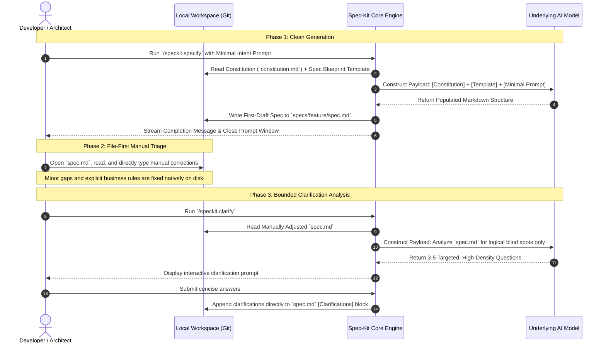

# Part 3. The Specify and Clarify Loop - Extracting Bulletproof Requirements Without Token Bloat

In [Part 2](spec-kit-under-the-hood-2.md), we optimized the global playground by compressing the constitution down to a lean, declarative set of immutable rules. With our system constraints solidified, we can now look at how Spec-Kit initiates a new feature.

The entry point of any new piece of functionality relies on a tight coordination loop between two commands: `/speckit.specify` and `/speckit.clarify`.

In traditional AI workflows, this is where massive token waste occurs. Developers often write extensive, unstructured prompts, or worse, get locked into long, conversational chat debates with an AI agent trying to refine a document. Every adjustment forces the model to re-digest the entire chat history and re-generate a massive markdown file from scratch—a massive "re-generation tax."

Spec-Kit completely bypasses this loop by enforcing a **file-first state architecture**. Let's peel back the curtain on the underlying mechanics of the specify-and-clarify loop to see how it extracts ironclad product requirements while protecting your token budget.

## The Mechanical Handshake: State-Driven Progress

The core architectural principle of Spec-Kit is that **memory belongs in the repository files, not in the LLM's active chat window.** Instead of relying on a persistent chat thread to handle iterative changes, Spec-Kit treats individual slash-commands as stateless functions that read and write directly to disk.

The loop moves through three distinct micro-phases, shifting the source of truth between the developer, the file system, and specialized agent layers:



## Phase 1: Designing the Input Payload (`/speckit.specify`)

When a developer executes `/speckit.specify`, the agent's prompt builder creates a tightly partitioned context window. It pulls the global `constitution.md`, reads the empty `templates/spec.md` blueprint, and appends the user's raw input.

Because the target layout and global constraints are already provided by the system, the user prompt does not need to be a long, narrative essay. To get the highest fidelity out of the underlying model, train your engineering team to use a highly dense **"What-Why-Who-Limits" block format**:

```text
/speckit.specify 
- WHAT: A drag-and-drop file uploader inside user profile settings.
- WHY: Users report that clicking a native file picker feels outdated.
- WHO: Standard authenticated users.
- LIMITS: Max 5MB per upload, JPEG or PNG formats only.
```

The model takes this small seed of intent, aligns it against your architectural stack inside the constitution, and maps it directly into the target markdown sections (User Stories, Core Workflows, Event Boundaries, and Acceptance Criteria) before immediately dropping the session context.

## Phase 2: Bypassing the Chat Window via File-First Adjustments

Once `specs/feature/spec.md` is written to your workspace, **the initial LLM chat context should be cleared.** If you notice a typo, a missing business requirement, or a minor misinterpretation in the generated file, **do not type a follow-up message into the agent chat window.** * **The Bad Way (Conversational):** Prompting _"Hey, you missed the requirement that images should be compressed client-side before uploading, please fix that"_ forces the LLM to process your system prompt, your original prompt, the 1,000-token markdown specification it just generated, and your correction. It then spends output tokens completely rewriting the entire 1,000-token file just to insert one sentence.

- **The Spec-Kit Way (File-First):** Open `specs/feature/spec.md` in your editor and type the constraint yourself: `- Must compress images client-side down to < 1MB before hitting the API.`
    

It takes a human 5 seconds to type a bullet point. By modifying the file directly on disk, you completely eliminate the re-generation tax and preserve perfect context hygiene for the next phase.

## Phase 3: Isolating Analytical Reasoning (`/speckit.clarify`)

Once you have applied your known corrections to the local markdown file, it is time to hunt for unhandled exceptions. This is the explicit job of `/speckit.clarify`.

Unlike the specify agent—which is optimized to _write and expand_ requirements—the clarify agent is a highly specialized, defensive critic. When executed, it pulls your local `spec.md` file from disk and evaluates it with a single, isolated prompt mandate: **Find logical contradictions, ambiguous state flows, or missing failure paths.**

The model doesn't rewrite anything yet. It simply outputs 3 to 5 highly specific questions directly to the terminal or agent chat interface:

> 1. _What should happen to the UI if an upload fails mid-transit due to a dropped network connection?_
> 2. _Do we need to retain an audit log of rejected file uploads, or do we only log successful profile updates?_

When you answer these targeted questions, the agent doesn't rewrite the whole specification. It surgically appends your exact answers into a dedicated `## Clarifications` appendix at the bottom of your local file.

## The Efficiency Payoff

By decoupling requirement expansion (`.specify`) from analytical audit loops (`.clarify`), and routing human adjustments directly through git-managed markdown files, Spec-Kit drastically reduces the token footprint of the product lifecycle phase.

|Metric / Scenario|Conversational Chatbot Workflow|Spec-Kit Decoupled Loop|
|---|---|---|
|**Iterative Edits**|3-4 prompt adjustments rewriting the full document.|Direct manual disk edits + 1 localized clarification append.|
|**Total Input Tokens**|~12,000+ tokens (compounding history)|~1,800 tokens (stateless, isolated steps)|
|**Total Output Tokens**|~4,000 tokens (frequent full-file rewrites)|~1,200 tokens (1 initial write + minor text appends)|
|**Context Drift Risk**|High (Model drops rules as history expands)|Zero (Disk-backed file stays perfectly bounded)|

## What’s Next

Your specification file is now locked down, verified by a human, hardened by an automated critique, and saved cleanly to disk under 300 lines of highly accurate text.

In [**Part 4: Blueprint to Code**](spec-kit-under-the-hood-4.md), we will move out of product requirements and dive into engineering execution, analyzing how `/speckit.plan` and `/speckit.tasks` consume this markdown state to map out architectural changes across your repository without inducing context window fatigue.