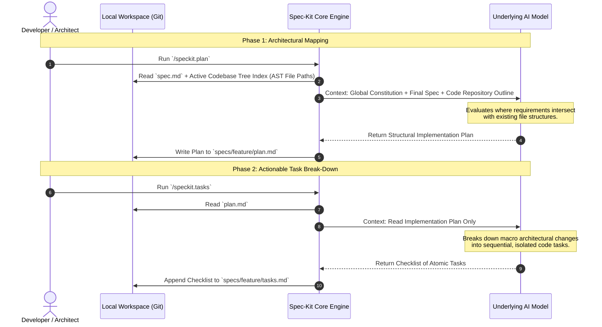

# Part 4. Blueprint to Code - How speckit.plan and speckit.tasks Prevent Architectural Drift

Up to this point in our best-practices series, our focus has been entirely within the domain of product requirements. We used `.constitution` to establish the global guardrails, and we synchronized `.specify` and `.clarify` to build a dense, hardened product specification (`spec.md`) under 300 lines of text.

Now comes the critical pivot in Spec-Driven Development (SDD): **translating business requirements into an engineering architecture.**

In standard AI assistance workflows, developers often paste their specification file along with five or six raw source files into a chat box and say, _"Implement this."_ This is an invitation for disaster. The LLM tries to simultaneously reason through product logic, parse large blocks of code syntax, and invent an implementation strategy on the fly. The result is almost always architectural drift, hallucinated APIs, and broke dependencies.

Spec-Kit solves this by splitting engineering execution into two distinct, highly isolated steps: `/speckit.plan` and `/speckit.tasks`. Let's look under the hood at the underlying data coordination and LLM interaction mechanics of this engineering transition.

## The Mechanical Boundary: Architecture vs. Break-Down

The core rule of context management during engineering execution is that **designing a plan is a completely separate cognitive task from scheduling atomic work.** The transition is handled via a programmatic two-step handshake that converts your requirement document into a technical blueprint, and then into an actionable, byte-sized checklist.



## Phase 1: The Context Injection Matrix of `/speckit.plan`

When you run `/speckit.plan`, the agent doesn't read your entire codebase line-by-line—doing so would immediately exhaust your token window and inject massive amounts of noisy syntax into the model's short-term memory.

Instead, Spec-Kit constructs a high-level representation of your repository. It builds a payload consisting of:

1. **The Global Constitution:** (To remind the model of your core stack, e.g., Next.js, .NET 8, PostgreSQL).
2. **The Finalized spec.md:**`spec.md` (The business requirements source of truth).
3. **The Repository File Tree Index:** An abstract layout of file paths, directories, and top-level entry points (controllers, routing files, data contexts).

The model evaluates these three inputs to map out the surface area of the change. It identifies exactly which existing files must be modified, which new files must be created, and which files can remain untouched.

The output is written to disk as `specs/feature/plan.md`. This file acts as a high-level blueprint:

```markdown
## Implementation Plan: Drag-and-Drop Photo Upload

### Proposed Changes
* CREATE: `src/components/ui/FileUploader.tsx` (New client component)
* MODIFY: `src/app/settings/profile/page.tsx` (Integrate uploader component)
* MODIFY: `src/api/profile/upload/route.ts` (Handle payload size validation)

### Data Flow Impact
* Component triggers client-side compression -> POST request to api route -> updates profile state.
```

## Phase 2: Protecting Attention via Atomic Break-Down (`/speckit.tasks`)

Once `plan.md` is written, you have a solid architectural map. But you still shouldn't write code yet. A macro plan like _"Modify the API route to handle payload size validation"_ contains multiple distinct steps. If an LLM attempts to execute that entire line at once, it will likely skip edge cases or fail to write clean error handling.

This is where `/speckit.tasks` steps in, enforcing a strict context filter.

When you run `/speckit.tasks`, the engine **completely isolates the payload.** It does _not_ look back at the original `spec.md`, nor does it pull the repository file index again. It reads **only** the `plan.md` blueprint. It asks the model a single, highly focused question: _"Break this macro architectural plan down into sequential, atomic execution blocks that a single agent can write without changing contexts."_

The model outputs a highly granular, checklist-style markdown file (`specs/feature/tasks.md`):

```markdown
## Task List: Photo Upload Implementation

- [ ] Task 1: Create `FileUploader.tsx` with basic drag-and-drop UI and file type constraints.
- [ ] Task 2: Implement client-side image compression logic inside `FileUploader.tsx`.
- [ ] Task 3: Update `route.ts` to implement 5MB hard boundaries and throw explicit HTTP 413 exceptions.
- [ ] Task 4: Integrate `FileUploader.tsx` into the profile settings page view.
```

## Why the Plan/Task Split Protects Token Budgets

By separating planning from task extraction, Spec-Kit avoids the **"Reasoning Overload"** that tanks typical AI coding assistants.

If you bundle planning and tasking into a single step, the model has to balance product logic, file paths, structural architecture, and micro-coding tasks all in the same output generation. The model's attention is spread thin across multiple cognitive layers, leading to generic plans and missed requirements.

By forcing a hard file boundary between `plan.md` and `tasks.md`, the model has a single objective per command:

- **The Planning Command** only focuses on **Where** changes happen.
    
- **The Tasking Command** only focuses on **How** to break those changes into a sequential timeline.
    

## What’s Next

Your feature has been analyzed, planned, and broken down into a hyper-focused checklist of independent engineering blocks. The architecture is locked down on disk.

In [**Part 5: Execution, Validation, and Customization**](spec-kit-under-the-hood-5.md), we will explore the final phase of the Spec-Kit lifecycle: running `/speckit.implement` against our isolated task list, applying surgical code diffs to our repository, and using quality gates to ensure the final code perfectly aligns with our initial constitution.