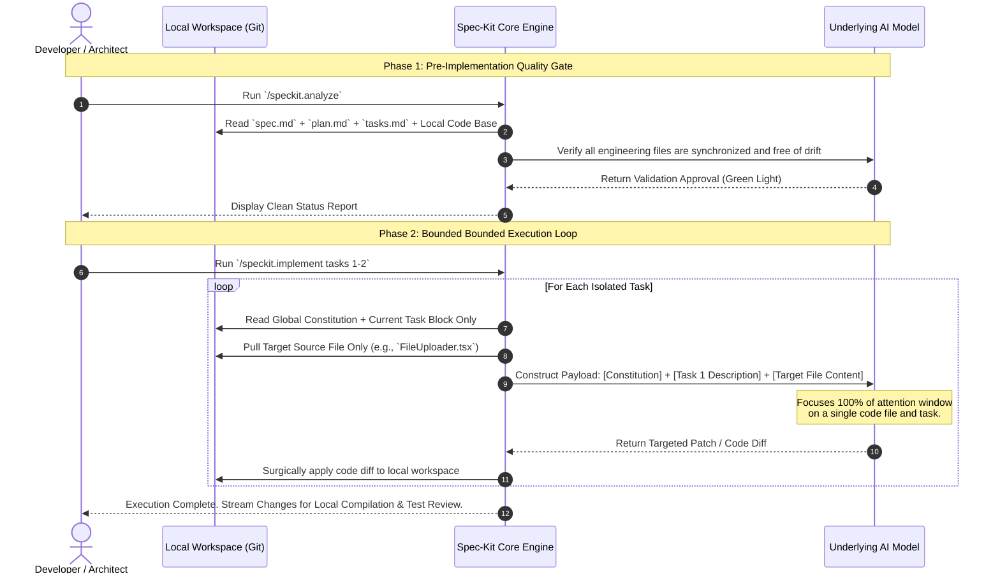

# Part 5. Execution, Validation, and Customization - Surgical Code Generation without Model Fatigue

We have arrived at the final frontier of the Spec-Kit lifecycle. Up to this point, our repository has accumulated an airtight, file-backed trail of markdown states: `.constitution` enforces our global engineering guardrails, `spec.md` outlines the verified product requirements, `plan.md` maps the targeted file architecture, and `tasks.md` breaks the work down into an atomic, sequential checklist.

Now, it is finally time to write code.

In a standard AI development workflow, this is where projects derail. Developers typically open their IDE chat panel, point the AI at an entire folder of source files, and ask it to execute a large feature. The model is forced to process thousands of lines of code syntax, track product logic, and maintain architectural constraints simultaneously. This massive cognitive load causes model fatigue, leading to dropped requirements, broken imports, and code regression.

Spec-Kit completely eliminates this problem by turning the execution phase into a highly restricted, automated production assembly line driven by `/speckit.analyze` and `/speckit.implement`. Let’s look at how this phase manages context at a surgical level to generate production-ready code with zero bloat.

## The Mechanical Boundary: Code Generation in Isolation

The foundational rule of Spec-Kit’s execution phase is that **the LLM should never be allowed to look at the entire task list or the entire codebase while writing code.** Instead, the Spec-Kit core engine constructs a hyper-focused, minimum viable context payload for every single line of code it modifies. It processes your checklist using a strict token-diet loop:



## Phase 1: The Pre-Implementation Quality Gate (`/speckit.analyze`)

Before a single line of code is generated, Spec-Kit enforces a strict static-analysis checkpoint using `/speckit.analyze`.

If a human developer has manually tweaked the code or adjusted the `plan.md` file since the last generation, the repository state might be out of alignment. The `/speckit.analyze` command acts as an automated compiler check. It reads your local files from disk and passes an analytical payload to the LLM to cross-check structural consistency.

The model explicitly validates:

1. **Requirements Coverage:** Does the `tasks.md` list cover 100% of the acceptance criteria defined in `spec.md`?
2. **Architectural Drift:** Do the target file modifications in `plan.md` match the file paths currently sitting in your git repository index?
3. **Constitutional Alignment:** Are the proposed changes free of any conflicts with your global `.constitution` rules?

Once the model verifies that your local workspace state is completely synchronized, it grants a "green light," ensuring you aren't building code on top of a fractured foundation.

## Phase 2: Bounded Execution via Scope Targeting

When you invoke code generation, you do not run a blanket, open-ended implementation command. To maintain an incredibly low token footprint and maximize model attention, you restrict the agent to narrow task boundaries using explicit scoping arguments:

```text
/speckit.implement tasks 1-2
```

By passing a restricted range, you radically alter the context payload sent to the underlying LLM. Let's compare the token ergonomics of this approach against a traditional conversational AI assistant:

### Traditional AI Assistant Payload (Massive Bloat)

- **System Prompt:** Generic instructions.
- **Chat History:** The original prompt, the full specification prose, the raw architectural plans, previous failed code iterations, and conversational fluff.
- **Code Context:** 5 to 10 full files pasted into the window so the model "has the whole picture."
- **Result:** **15,000+ input tokens.** The model's attention window is heavily diluted. It easily overlooks edge cases, hallucinates utility functions, and drops structural boundaries.

### Spec-Kit Bounded Payload (Surgical Precision)

- **System Prompt:** Your 600-token global `.constitution`.
- **Isolated Intent:** The precise text block for _Task 1 and Task 2 only_ extracted directly from `tasks.md`.
- **Surgical Code Target:** The _single_ source file needing modification (e.g., `FileUploader.tsx`).
- **Result:** **~1,500 input tokens.** Because the context window is entirely stripped of historical chat noise, old iterations, and unrelated files, the model applies 100% of its reasoning capacity directly to the target syntax.

The model generates a clean, precise code patch or a completely structured new file, which Spec-Kit automatically writes directly to your local workspace.

## Execution Behavior & Automated Supervision

As `/speckit.implement` marches through your bounded task range, it continuously reconciles its outputs against your repository's local environment. It doesn't just vomit text into your editor; it works under your direct supervision:

- **Surgical Code Diffs:** The agent modifies your codebase using precise structural patches rather than completely rewriting large files, preventing accidental deletions of neighboring code blocks.
- **Local Command Execution:** Depending on your environment configurations, the agent can be granted bounded permissions to trigger local terminal commands—such as running `npm run lint`, running unit tests, or executing a backend build script—to verify that its own code passes local quality checks before completing the command.
- **Constitutional Compliance:** Every generated code block is checked against your constitution's strict architectural limitations (e.g., ensuring an image uploader utilizes OpenTelemetry logging protocols to Cloud Trace, as commanded by the global rules we established in Part 2).

## Series Summary: The Golden Rules of Context Management

We have now tracked the entire Spec-Driven Development journey from an abstract global rule to a compiled line of production code. By maintaining a strict data-diet across all 7 main steps of Spec-Kit, we turn LLM interactions into an exceptionally predictable, cost-effective engineering asset.

As you scale Spec-Kit across your enterprise software delivery teams, print out these four golden rules of context management:

1. **Memory belongs in files, not in the chat window.** Clear your conversational agent history frequently; let markdown files on disk store the application state.
2. **Enforce declarative constraints.** Write your `.constitution` using strict "NEVER/ALWAYS" parameters to slash global input tokens by up to 80%.
3. **Pay no re-generation tax.** Edit your local `spec.md` and `plan.md` documents directly in your IDE for quick iterations instead of arguing with a chatbot to rewrite them.
4. **Isolate your execution scopes.** Never let an LLM write code for an entire feature at once. Run `/speckit.implement` against narrow task boundaries to maintain absolute code fidelity.